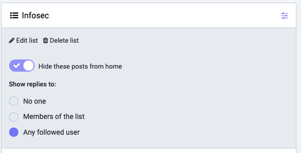
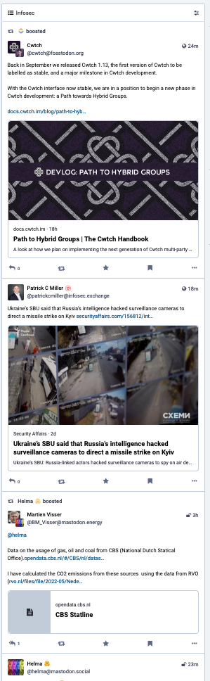

# Subscribodil

Subscribodil uses the Mastodon API to subscribe people to your account and then add them to a list.

Why is that useful?

- You want to follow a lot of people, but you do not want those peoples posts to spam your home (main) timeline.
- In order to actually receive posts from a person you must follow to them.
  Otherwise, their Mastdon instance wouldn't know that your instance is supposed to get a copy of their message.
- Starting with Mastdon 4.2, you can put people into lists and suppress their posts in your home timeline.
  In order to do that, go to the list, press the list config button at the upper right in the web interface
  and check `[x] Hide these posts from home`.



- By selecting the list you can now read all these people topically, in a list.



- This tool reads a Mastodon "Followlist" import file, subscribes all people from the file, and
  puts them all into a single list.
- In order to be able to do that it needs to be configured as a Mastodon application.
  This is a one-time setup process, in which you tell Mastodon that you have a script, 
  what you allow the script to do, and Mastodon will give you credentials for that.

## Installation

```bash
# Clone the repo
git clone https://github.com/isotopp/subscribodil.git
# change into the repo
cd subscribodil
# set up a virtual environment
python3 -mvenv venv
# activate it
source venv/bin/activate
# update it
pip install -U pip wheel
# install dependencies
pip install -r requirements.txt
# test it
python subscribodil.py --help
```

## Usage

```bash
python subscribodil.py --help
Usage: subscribodil.py [OPTIONS]

Options:
  --list-name TEXT   The name of the list to subscribe these people to.
                     [default: Infosec]
  --file TEXT        The source csv file.  [default:
                     mastodon_infosec_import.csv]
  --retry-file TEXT  The file to write failed accounts to.  [default:
                     retry.csv]
  --help             Show this message and exit.
```

Substitute your mastodon instance name for "chaos.social":
1. Go to https://chaos.social/settings/applications and create a new application subscribodil.
2. Give it "read write:follows write:lists follow" permissions.
3. Grab the credentials from the subscribodil application you just created and put them into a .env file.
   ```
   CLIENT_KEY=redacted
   CLIENT_SECRET=redacted
   ACCESS_TOKEN=redacted
   API_BASE_URL=https://chaos.social <- your instance here
   ```
4. Download https://raw.githubusercontent.com/cstromblad/infosec_mastodon/main/mastodon_infosec_import.csv
   from https://github.com/cstromblad/infosec_mastodon/tree/main
5. Run it with the venv acticated:
   ```
   source venv/bin/activate
   python main.py
   ```

# What is a Subscribodil?

It is a cute little crocodile that manages your lists for you.


# Issues

1. (fixed) "TypeError: unsupported operand type(s) for |: 'type' and 'NoneType'"

I had been using "str | None" as a type annotation. This is supported only in Python 3.10 and higher.
I have reverted this to
```python
from typing import Optional

def some_function(...) -> Optional[str]:
   pass
```
to make it work with older Python.

2. "NotOpenSSLWarning: urllib3 v2 only supports OpenSSL 1.1.1+, currently the 'ssl' module is compiled with 'LibreSSL 2.8.3'"

You are on MacOS.
Apple is on a crusade against the GPL 3 because of the Software Patents clauses in there.
All things in MacOS are being built without GPL 3 code, and ultimately without GPL code.
Hence the old (3.x) bash, the weird rewrite of Samba and the drop of CUPS.

Install [Homebrew](https://brew.sh), check the install with `brew doctor`.
Then install first `brew install openssl`, and `brew install python@3.12` after that.

You get a proper and modern Python. Add it to the `PATH` first.

